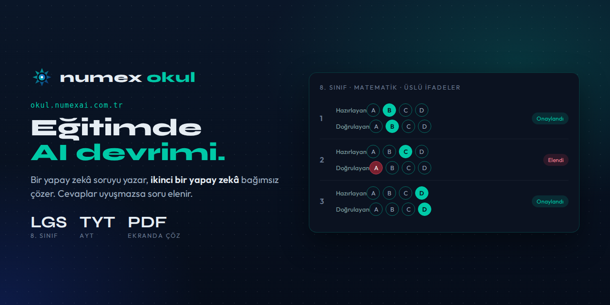

<div align="center">



# 🎓 Numex Okul

### Eğitimde AI devrimi — iki yapay zekâ ile doğrulanmış testler.

[](https://okul.numexai.com.tr)
[](https://okul.numexai.com.tr)
[](https://okul.numexai.com.tr)

</div>

---

> *Yapay zekânın hazırladığı bir testte cevap anahtarı yanlışsa ne olur? Öğrenci yanlışı öğrenir.*
> Numex Okul bunu çözmek için var.


🔗 **[okul.numexai.com.tr](https://okul.numexai.com.tr)** · *Doğrulanmış testler*

> **Eğitimde AI Devrimi** — Öğrenciler, veliler ve öğretmenler için yapay zekâ destekli test
> platformu. *Konunu seç, doğrulanmış testini al, eksiğini gör, geleceğini şekillendir.*

## Nasıl çalışır?

```
① Seviye & konu seç  ──▶  ② AI üretir, ikinci AI doğrular  ──▶  ③ Ekranda çöz ya da PDF al
```

1. **Seviye** (ör. 8. Sınıf), **Ders** (ör. Matematik) ve **Konu** seçilir — konu yazılıp Enter'a
   basılabilir ya da hazır konu çiplerinden seçilir (*Çarpanlar ve Katlar, Üslü İfadeler, Kareköklü
   İfadeler, Cebirsel İfadeler, Doğrusal Denklemler, Eşitsizlikler, Olasılık, Üçgenler…*).
2. **Soru sayısı**, **zorluk** (Kolay / Orta / Zor) ve **süre** (Süresiz ya da süreli) ayarlanır.
3. İsteğe bağlı **"Önce Konu Anlatımı"** — testten önce konunun özeti.
4. **Testi Oluştur.**

## 🛡️ Çift yapay zeka doğrulaması

Numex Okul'un farkı: her soruyu **bir AI hazırlar, ikinci bir AI bağımsız olarak çözer**.

| Soru | Hazırlayan | Doğrulayan | Sonuç |
|---|---|---|---|
| 1 | B | B | ✅ **Onaylandı** |
| 2 | C | A | ❌ **Elendi** — yerine yeni soru üretilip aynı kontrolden geçirilir |
| 3 | D | D | ✅ **Onaylandı** |

İki yapay zekanın cevabı uyuşmayan soru **teste girmez**. Böylece yanlış cevap anahtarlı soru riski
en aza iner — [Detective Mode™](https://github.com/numexai/numex_nedir/blob/main/urunler/07-deepview.md) yaklaşımının eğitimdeki uygulaması.

## ⚡ Hızlı başla — tek tıkla örnek test

| | |
|---|---|
| 📘 **LGS Hazırlık** — 8. Sınıf · Matematik | Σ **TYT Matematik** — Temel Kavramlar |
| ⚡ **AYT Fizik** — Kuvvet ve Hareket | 🌐 **Lise İngilizce** — Tenses |
| 🚗 **Ehliyet Sınavı** — Trafik İşaretleri | 📗 **Ortaokul Türkçe** — Sözcükte Anlam |

## Kimler için?
- **Öğrenciler:** LGS, TYT, AYT hazırlığı; eksik konuyu görme.
- **Veliler:** Çocuğun seviyesine uygun, doğrulanmış deneme.
- **Öğretmenler:** Dakikalar içinde PDF test; sınıfa dağıtım.
- **Kurumlar:** **Kurumsal** hesap desteği.
- **Herkes:** Ehliyet sınavı gibi genel sınavlar.

---


---

<div align="center">

**Numex Ailesi** · [Numex AI](https://numexai.com.tr) · [Codex](https://github.com/numexai/numex-codex) · [Okul](https://github.com/numexai/numex-okul) · [Market](https://market.numexai.com.tr) · [Numexpedia](https://github.com/numexai/numex-pedia) · [Hub](https://github.com/numexai/numex-hub) · [Forge](https://github.com/numexai/numex-forge) · [API](https://github.com/numexai/numex-api) · [SDK](https://github.com/numexai/numex-sdk) · [Pusulam](https://github.com/mobilcep/pusulamx) · [PC Doktoru](https://github.com/mobilcep/pcdoktoru)

*İnsanı önce koyan Türk yapay zekâsı* 🇹🇷 · [Tüm ekosistem →](https://github.com/numexai/numex_nedir)

</div>
